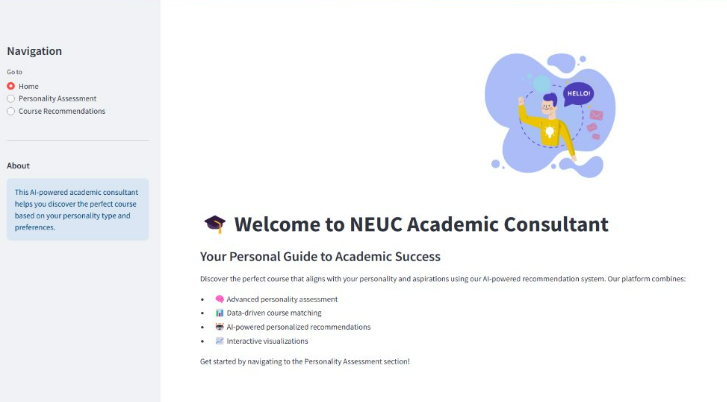
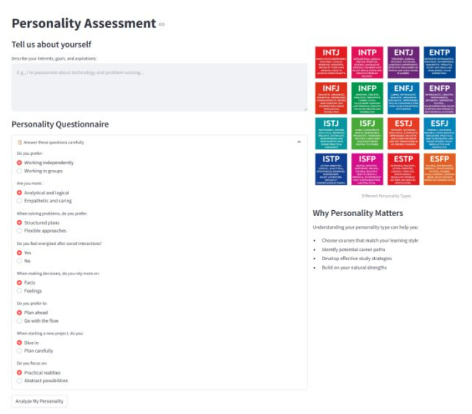
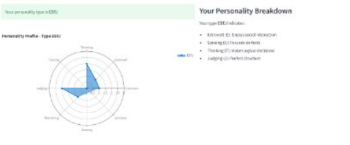
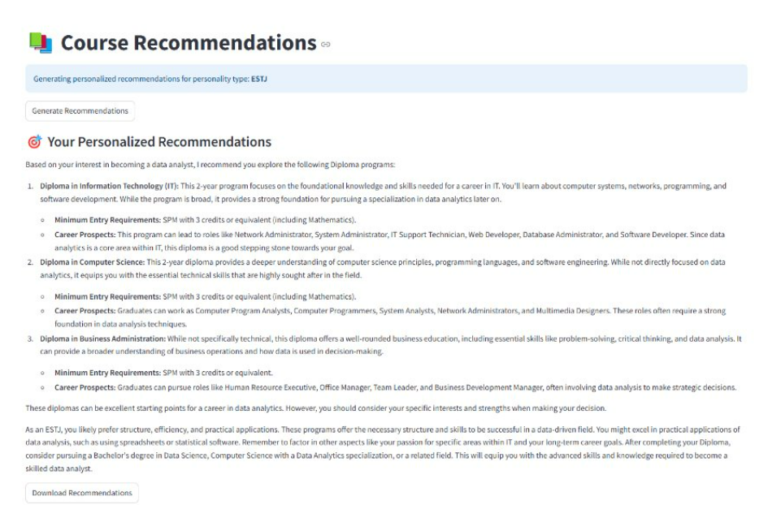

# NEUC Academic Consultant


**NEUC Academic Consultant** is an AI-powered tool designed to help students explore courses that align with their personality and academic goals. Using MBTI-based personality assessments and AI-driven recommendations, this tool offers customized academic guidance tailored to each user.

## Table of Contents

- [Features](#features)
- [Installation](#installation)
- [Usage](#usage)
- [Code Explanation](#code-explanation)
- [Demo](#demo)

---

## Features

- 🎓 **Personalized Course Recommendations**: Find courses suited to your personality.
- 🧠 **Personality Assessment**: Complete an MBTI-based questionnaire for self-discovery.
- 📊 **Data-driven Insights**: Visualize personality types with interactive radar charts.
- 📈 **Progress Animation**: Experience smooth, dynamic feedback during usage.
- 🤖 **AI-Powered Suggestions**: Leverage AI to receive academic advice based on personal traits.

---

## Installation

1. **Clone the Repository**
    ```bash
    git clone https://github.com/yourusername/neuc-academic-consultant.git
    ```

2. **Install Dependencies**
    - Run the following command to install all necessary libraries:
    ```bash
    pip install -r requirements.txt
    ```

3. **Set Environment Variables**
   - Create a `.env` file in the project directory.
   - Add your Google Generative AI API key:
     ```plaintext
     GEMINI_API_KEY=your_api_key_here
     ```

---

## Usage

1. **Start the Application**
   - Use Streamlit to launch the app:
     ```bash
     streamlit run app.py
     ```

2. **Application Pages**
   - **Home**: Introduction to the consultant and its features.
   - **Personality Assessment**: Complete a personality quiz and get an MBTI-based profile.
   - **Course Recommendations**: Receive AI-generated course suggestions based on your personality type and academic interests.

---

## Code Explanation

### Main Components

- **Lottie Animation (`load_lottie_url`)**: Adds engaging animations to the app for a smooth UX.
- **Radar Chart (`create_radar_chart`)**: Visualizes the MBTI personality traits using Plotly's radar chart.
- **Progress Animation (`create_progress_animation`)**: Displays a progress bar during API requests or loading.
- **AI-Generated Recommendations (`generate_recommendations`)**: Uses Google Generative AI to provide course recommendations.

### Function Descriptions

- **`load_lottie_url`**: Fetches Lottie animations from a URL.
- **`create_radar_chart`**: Builds a radar chart to display personality scores visually.
- **`create_progress_animation`**: Creates a progress bar animation during the loading process.
- **`generate_recommendations`**: Customizes course recommendations based on personality type and interests.

---

## Demo

- Navigate to the **Personality Assessment** page to take the quiz.

- Get instant personality insights with a radar chart.

- Proceed to **Course Recommendations** to see your AI-powered suggestions.

- Download the recommendations as a `.txt` file for future reference.

---
